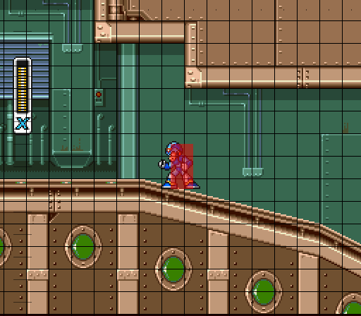

# Leap

An opinionated toolkit for creating 2D platformers on top of
the [Flame engine](https://flame-engine.org/).

## WARNING library under development

Be aware that this is still under development and is likely to change frequently, every release
could introduce breaking changes up until a `v1.0.0` release (which may never happen as this is a
solo endeavour currently).

## Features

### Level creation via Tiled

Leap uses Tiled tile maps not just for visually rendering the level, but also for imbuing behavior
and terrain in the level by creating corresponding Flame components automatically from the map's
layers.

### Physics

The crux of this physics engine is based on this post The guide to implementing 2D platformers:
http://higherorderfun.com/blog/2012/05/20/the-guide-to-implementing-2d-platformers/

The "Type #2: Tile Based (Smooth)" section outlines the overall algorithm.

Note that Leap doesn't use Flame's collision detection system in favor of one that is more
specialized and efficient for tile based platformers where every hitbox is an axis-aligned bounding
box, and special handling can be done for tile grid aligned components (such as ground terrain).

#### Efficient collision detection



Essentially all physical objects (`PhsyicalComponent`) in the game have axis-aligned bounding boxes
(AABBs) for hitboxes, determined by their `size` and `position`. The hitbox doesn't necessarily need
to match the visual size of the component.

✅ Supported tile platformer features:

- Ground terrain
- One way platforms
- Slopes

🚧 Future tile platformer features:

- Moving platforms
- Ladders

#### Simple physics designed for 2D platformers

Long story short, physics engines like `box2d` are great for emulating realistic physics and
terrible for implementing retro-style 2d platformers which are not remotely realistic. In order to
get the snappy jumps and controls required for a responsive platformer a much more rudimentary
physics engine is required.

In Leap, physical entities have a `velocity` attribute for storing the current `x` and `y` velocity,
which will automatically update the entity's position. A moving entity colliding with the level
terrain will automatically have its velocity set to `0` and position updated to be kept outside the
terrain to prevent overlap. There is also a global `gravity` rate applied to the `y` velocity every
game tick. Static entities will never be moved by velocity or gravity.

## Getting started

Before using Leap, you should be familiar with the following Flame components:

- FlameGame
- Camera
- PositionComponent
- TiledComponent

## Usage

### LeapGame

To use Leap, your game instance must extend `LeapGame` (which in turn extends `FlameGame`). It's
recommended to use `game.loadWorldAndMap` to initialize the game's `world` and `map`.

### LeapWorld

Accessible via `LeapGame.world`, this component manages any global logic necessary for the physics
engine.

### LeapMap

Accessible via `LeapGame.map`, this component manages the Tiled map and automatically constructs the
tiles with proper collision detection for the ground terrain.
See [Tiled map integration](#Tiled map integration) below

### Game code snippet

See [the standard_platformer example](examples/standard_platformer) for complete game code.

```dart
void main() {
  runApp(GameWidget(game: MyLeapGame()));
}

class MyLeapGame extends LeapGame with HasTappables, HasKeyboardHandlerComponents {
  late final Player player;

  @override
  Future<void> onLoad() async {
    await super.onLoad();

    // "map.tmx" should be a Tiled map the meets the Leap requirements defined below
    await loadWorldAndMap('map.tmx', 16);
    setFixedViewportInTiles(32, 16);

    player = Player();
    add(player);
    camera.followComponent(player);
  }
}
```

### Tiled map integration

Leap automatically parses specific features out of specific Tiled layers.

#### Ground layer

Layer must be a Tile Layer named "Ground", by default all tiles placed in this layer are assumed to
be ground terrain in the physics of the game. This means these tiles will be statically positioned
and have a hitbox that matches the width and height of the tile.

Specialized ground tiles:

- **Slopes** for terrain the physical can walk up/down like a hill. These tiles must have
  their `class` property set to `"Slope"` and two custom `int` properties `LeftTop` and `RightTop`.
  For example, a 16x16 pixel tile with `LeftTop = 0` and `RightTop = 8` indicates slope that is
  ascending when moving from left-to-right.
- **Platforms** (name may change) for terrain the physical entities can move up (e.g. jump) through
  from below but still land on. These tiles must have their `class` property set to `"Platform"`.

#### Metadata layer

Layer must be an Object Group named "Metadata", used to place any objects to be used in your game
like level start/end, enemy spawn points, anything you want.

#### Object Group layers

Any Object Group layer (including the Metadata layer) can include arbitrary objects in them,
if you wish to automatically create Flame Components for some of those objects you can do so
based on the Class string in Tiled. All that is required is implementing the `TiledObjectFactory`
interface and mapping each Class string you care about to a factory instance when loading the
`LeapMap`, for example...

In your `LeapGame`:

```dart
await loadWorldAndMap(
  camera: camera,
  tiledMapPath: 'map.tmx',
  tiledObjectHandlers: {
    'Coin': await CoinFactory.createFactory(),
  },
);
```

Your custom factory:

```dart
class CoinFactory implements TiledObjectFactory<Coin> {
  late final SpriteAnimation spriteAnimation;

  CoinFactory(this.spriteAnimation);

  @override
  void handleObject(TiledObject object, Layer layer, LeapMap map) {
    final coin = Coin(object, spriteAnimation);
    map.add(coin);
  }

  static Future<CoinFactory> createFactory() async {
    final tileset = await Flame.images.load('my_animated_coin.png');
    final spriteAnimation = SpriteAnimation.fromFrameData(
      tileset,
      SpriteAnimationData.sequenced(...),
    );
    return CoinFactory(spriteAnimation);
  }
}

class Coin extends PhysicalEntity {
  Coin(TiledObject object, this.animation)
      : super(static: true, collisionType: CollisionType.standard) {
    anchor = Anchor.center;
    
    // Use the position from your Tiled map
    position = Vector2(object.x, object.y);
    
    // Use custom properties from your Tiled object
    value = tiledObject.properties.getValue<int>('CoinValue');
  }
  
  ...
}
```

#### Other layer

Any other layers will be rendered visually but have no impact on the game automatically. You can add
additional custom behavior by accessing the layers via `LeapGame.map.tiledMap` and integrating your
own special behavior for tiles or objects.

#### Customizing layer names and classes

Even though the structure explained above should always be followed, the developer can ask Leap
to use different classes, types, names.

In order to do so, a custom `LeapConfiguration` can be passed to the game.

Example:

```dart
class MyLeapGame extend Leap {
  MyLeapGame() : super(
    configuration: LeapConfiguration(
      tiled: const TiledOptions(
        groundLayerName: 'Ground',
        metadataLayerName: 'Metadata',
        playerSpawnClass: 'PlayerSpawn',
        hazardClass: 'Hazard',
        damageProperty: 'Damage',
        platformClass: 'Platform',
        slopeType: 'Slope',
        slopeRightTopProperty: 'RightTop',
        slopeLeftTopProperty: 'LeftTop',
      ),
    ),
  );
}
```

## Roadmap 🚧

- Improved collision detection API.
    - The current API is fairly awkward, see `CollisionInfo`.
    - There is no great way to detect collision start or collision end.
- Add support for moving platforms and ladders.
- Add more robust and reusable base class for players/enemies/etc. (`Character` class).
    - Integrated with sprite animations based on character state
- Improved API for `PhysicalEntity`, `addImpulse` etc.
- Lots of code clean-up to make usage of Leap more ergonomic and configurable.

## Contributing

1. Ensure any changes pass:
    - `melos format`
    - `melos analyze`
    - `melos test`
2. Start your PR title with a [conventional commit](https://www.conventionalcommits.org/en/v1.0.0/)
   type (feat:, fix: etc).
